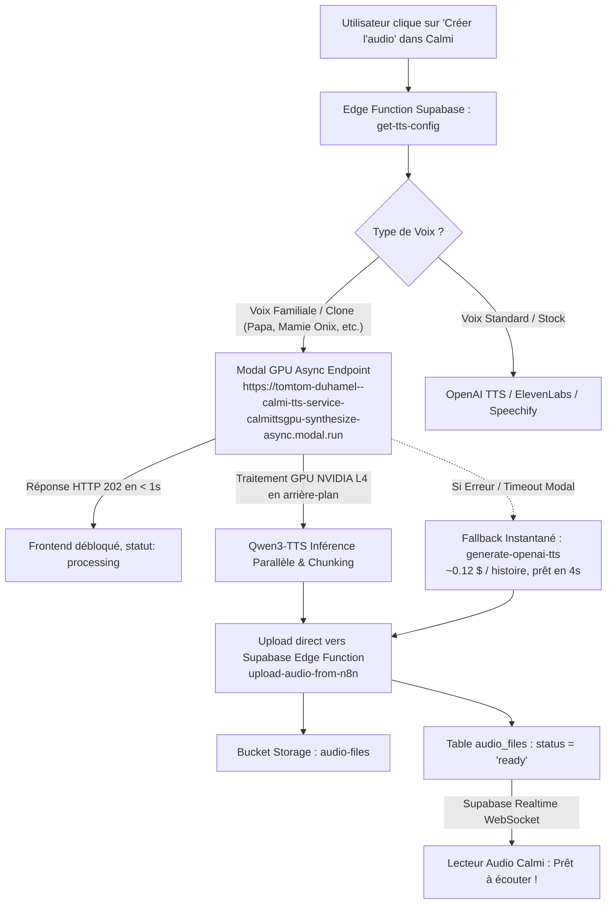

# Calmi TTS Private Architecture & Voice Cloning Roadmap

Ce document sert de mémoire persistante pour résumer l'intégration de la synthèse vocale privée (TTS) sur **Modal.com Serverless GPU (NVIDIA L4)**, le fallback **Hostinger VPS KVM2** et le routage des clones de voix utilisateur dans **Calmi**.

---

## 1. Vue d'Ensemble de l'Architecture Opérationnelle (Août 2026)



---

## 2. Modal.com Serverless GPU : Modèle & Endpoints de Production

L'infrastructure principale de synthèse pour les clones vocaux s'exécute sur des **GPU NVIDIA L4** via Modal.com.

### A. Endpoints Actifs
1. **Endpoint Asynchrone Principal (Production)** :
   - **URL** : `https://tomtom-duhamel--calmi-tts-service-calmittsgpu-synthesize-async.modal.run`
   - **Méthode** : `POST`
   - **Comportement** : Valide la requête, répond immédiatement avec `HTTP 202 Accepted` et lance la tâche `process_async_task` sur GPU L4.
   - **Post-traitement** : Modal envoie automatiquement le fichier audio `.wav` généré vers `https://ioeihnoxvtpxtqhxklpw.supabase.co/functions/v1/upload-audio-from-n8n` avec le secret webhook.
2. **Endpoint Synchrone (Tests & Validation Directe)** :
   - **URL** : `https://tomtom-duhamel--calmi-tts-service-calmittsgpu-synthesize.modal.run`
   - **Méthode** : `POST`
   - **Comportement** : Calcule et retourne directement le binaire `.wav` dans la réponse HTTP.

### B. Spécification du Payload JSON
```json
{
  "text": "Texte complet de l'histoire...",
  "language": "fr",
  "voice_ref_url": "https://ioeihnoxvtpxtqhxklpw.supabase.co/storage/v1/object/sign/voice-clones/.../sample.webm?token=...",
  "ref_text": "Transcription exacte de la phrase enregistrée par l'utilisateur",
  "instruct": "Warm, gentle bedtime story narrator for children, soft and peaceful pace",
  "sentence_pause_ms": 250,
  "paragraph_pause_ms": 1000,
  "chapter_pause_ms": 3000,
  "enable_sleep_pacing": true,
  "requestId": "uuid-request-id",
  "webhook_id": "uuid-request-id",
  "storyId": "uuid-story-id",
  "story_id": "uuid-story-id",
  "voiceId": "uuid-voice-id",
  "isCustomVoice": true
}
```

---

## 3. Déploiement et Code Source Modal (`vps-tts-service/modal_app.py`)

### A. Composants Clés de `modal_app.py`
- **Volume persistant** : `calmi-tts-cache` monté sur `/cache` pour stocker les poids du modèle HuggingFace (`HF_HOME=/cache/huggingface`) et le cache des voix de référence converties (`/cache/voices_cache`).
- **Modèle IA** : `Qwen/Qwen3-TTS-12Hz-0.6B-Base` chargé avec `torch.inference_mode()`, optimisé avec TF32 et Flash SDP.
- **Conversion automatique** : FFmpeg intégré dans l'image Docker pour convertir tout format entrant (`.webm`, `.mp3`, `.m4a`) en **WAV PCM 24 kHz mono** conforme aux exigences de Qwen3-TTS.
- **Chunking optimisé (`chunk_text_optimized`)** : Découpage intelligent par paragraphes (jusqu'à 1000 caractères par bloc) avec insertion de silences naturels sur CPU sans consommer de VRAM.

### B. Commande de Re-déploiement Modal (si modification de code)
```bash
# Dans le dossier racine ou vps-tts-service :
modal deploy vps-tts-service/modal_app.py
```

---

## 4. Intégration Frontend & Edge Functions Supabase

### A. Edge Function `get-tts-config`
- **Fichier** : `supabase/functions/get-tts-config/index.ts`
- **Rôle** : Fournit dynamiquement la configuration TTS et les URLs des webhooks au client.
- **Configuration par défaut** :
  - `provider`: `'modal-gpu'`
  - `modalWebhookUrl`: `'https://tomtom-duhamel--calmi-tts-service-calmittsgpu-synthesize-async.modal.run'`
  - `webhookUrl`: Point d'entrée n8n ou Modal.

### B. Hook Frontend `useN8nAudioGeneration.ts`
- **Fichier** : `src/hooks/story/audio/useN8nAudioGeneration.ts`
- **Routage intelligent** :
  - Si `payload.isCustomVoice === true` ou `provider === 'modal-gpu'`, le hook envoie directement la requête à `modalWebhookUrl`.
  - Crée l'entrée en base `audio_files` avec `status: 'pending'`, puis passe à `status: 'processing'`.
  - Écoute en temps réel via WebSocket Supabase Realtime (`audio_files_realtime_{storyId}`) pour détecter le passage à `ready`.

### C. Edge Function `upload-audio-from-n8n`
- **Fichier** : `supabase/functions/upload-audio-from-n8n/index.ts`
- **Rôle** : Reçoit le binaire audio `.wav` généré par Modal GPU ou n8n, l'enregistre dans le bucket Storage `audio-files`, et passe le statut en `ready`.
- **Authentification** : Header `x-webhook-secret: qpga8m5UFVedaXVf8D/coKlMoycSuA0qqFGk1UuvTQc=`.

---

## 5. Guide de Dépannage & Diagnostic Rapide

### Problème : L'audio reste en statut "processing"
1. **Tester l'endpoint Modal GPU en direct** :
   ```bash
   python -c "import requests; print(requests.post('https://tomtom-duhamel--calmi-tts-service-calmittsgpu-synthesize-async.modal.run', json={'text': 'Test', 'webhook_id': 'test-check-1', 'story_id': 'test-story-1'}).json())"
   ```
   - Doit retourner `{'status': 'accepted', ...}`.
2. **Vérifier l'enregistrement dans la table `audio_files`** :
   - Vérifier si `webhook_id` correspond bien à l'identifiant envoyé à Modal.
3. **Vérifier les logs Edge Function** :
   - Inspecter les logs de `upload-audio-from-n8n` sur le dashboard Supabase.

---

## 6. Table de Référence des Performances & Coûts

| Métrique | Modal Serverless GPU (NVIDIA L4) | VPS Hostinger KVM2 (CPU) |
| :--- | :--- | :--- |
| **Temps de calcul (Histoire 10 min, ~10 000 chars)** | **~8 à 15 minutes** | ~1h15 à 1h30 (sature le serveur) |
| **Scalabilité / Parallélisme** | **Illimité (Containers instanciés à la volée)** | 1 seule histoire séquentielle |
| **Format audio de référence** | `.webm`, `.wav`, `.mp3` (converti auto par FFmpeg) | `.wav` 24kHz obligatoire |
| **Coût estimé** | ~0,23 $ USD / histoire (inclus dans le crédit mensuel) | Inclus forfait VPS |


